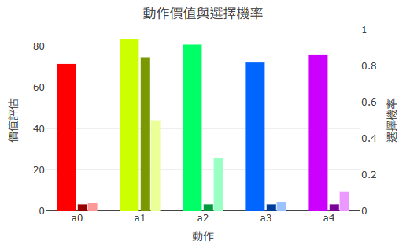

### **3.2 演算法設計**

RR 平台的學習核心由兩層演算法構成：以 **Q-Table（表格式 Q-Learning）** 為基礎主流程，並在其上疊加自行設計的 **Q 表蒸餾式 DQN**，形成一套兼顧可解釋性與泛化能力的混合學習架構。本節依序說明狀態離散化與 Bellman 更新機制（3.2.1）、Q 表蒸餾式 DQN 的雙向互學設計（3.2.2），以及探索策略的實作（3.2.3）。

---

#### **3.2.1 Q-Table 學習主流程（狀態離散化、Bellman 更新）**

**（一）狀態離散化**

強化學習中，許多任務環境（如 CartPole 的車速、heli 的飛行高度）皆以連續數值描述狀態。Q-Table 屬於表格式方法，需要有限個、可枚舉的狀態索引，因此平台在收到遊戲的 `gameInfo` 訊息後，即依據各維度宣告的數值範圍（min、max）與分桶數量（numBins），對每個狀態維度進行**等寬離散化（equal-width discretization）**。

給定一個狀態維度值 $v$，其桶編號 $b$ 的計算方式為：

$$
\text{binSize} = \frac{\max - \min}{N}, \quad
b = \left\lfloor \frac{\text{clip}(v,\ \min,\ \max) - \min}{\text{binSize}} \right\rfloor
$$

其中 $N$ 為該維度的分桶數，$\text{clip}$ 函數將超出宣告範圍的值壓至邊界桶，防止陣列越界。整體狀態的 Q-Table 索引鍵（state key）由各維度桶編號以底線串接組成，例如三維狀態的某個採樣點可能對應鍵值 `"3_7_12"`。此設計讓 Q-Table 能在不修改平台程式碼的情況下，自動適應任意維度數量與數值範圍的任務環境。

**（二）Bellman 更新與樂觀值 ψ**

每次收到遊戲回傳的 `reward_state` 後，平台依據標準 Q-Learning 的 Bellman 方程式更新前一步的 Q 值：

$$
Q(s, a) \leftarrow Q(s, a) + \alpha \left[ r + \gamma \cdot \text{targetQ} - Q(s, a) \right]
$$

其中 $\alpha$ 為學習率（learning rate）、$\gamma$ 為折扣因子（discount factor）、$r$ 為即時報酬。$\text{targetQ}$ 為對下一狀態 $s'$ 未來報酬的估計值，其計算引入一個自行設計的**樂觀值參數 $\psi$**，用以在 Q-Learning 與 SARSA 之間連續插值：

$$
\text{targetQ} = (1 - |\psi|) \cdot Q(s', a') + \max(0, \psi) \cdot \max_a Q(s', a) + \max(0, -\psi) \cdot \min_a Q(s', a)
$$

其中 $a'$ 為下一步實際選擇的動作。三個邊界情形的語意如下：

| $\psi$ 值 | targetQ 等效行為 | 對應的演算法語意 |
|----------|-----------------|-----------------|
| $\psi = 0$ | $Q(s', a')$（實際下一步動作） | 接近 SARSA（On-policy） |
| $\psi = 1$ | $\max_a Q(s', a)$（最佳動作估值） | 標準 Q-Learning（Off-policy） |
| $\psi = -1$ | $\min_a Q(s', a)$（最差動作估值） | 悲觀估計（保守策略） |

學習者可透過右側儀錶的滑桿即時調整 $\psi$，觀察智能體在不同估計傾向下策略收斂行為的差異，藉此建立對 On-policy 與 Off-policy 之間差異的直觀認識。

**（三）回溯軌跡機制（Trace）**

標準 Q-Learning 每步只更新當前的 $(s, a)$，一次 episode 中的獎勵訊號往往需要經過多回合才能從終局回溯至起點，學習速度偏慢。RR 平台在標準更新之上，額外實作一套**等權回溯軌跡（backward trace）**機制：平台維護一條長度上限為 5 步的歷史記錄 $(s_t, a_t, r_t, s_{t+1})$；每當收到非零獎勵時，立刻對整段軌跡做一次批次回溯更新，使獎勵訊號能在同一 episode 內更快向前傳播。此設計概念上類似強化學習文獻中的 Eligibility Trace（TD(λ)），但採用等權（無衰減）、固定長度的簡化版本，在教學情境中更易於說明與理解。


**圖 3-3　Q-Learning 訓練主迴圈與回溯軌跡機制流程圖**

---

#### **3.2.2 Q 表蒸餾式 DQN（雙向互學架構、知識同步率）**

**（一）設計動機：為何不採用標準 DQN**

標準的深度 Q 網路（DQN）直接從環境互動的 $(s, a, r, s')$ 四元組訓練神經網路，通常搭配經驗回放（experience replay）從歷史資料池中抽樣學習。然而在 RR 平台的教學情境中，此設計面臨一個結構性問題：**智能體在探索初期，走訪的狀態分佈極度不均勻**，經驗資料池中大量重複的相似狀態會導致神經網路的訓練嚴重偏斜，難以收斂至有意義的策略。

Q-Table 的等寬分桶機制天然地將狀態空間切分為均勻格子，每個桶中心點代表一個具有代表性的典型狀態。以 Q-Table 已探索的桶作為訓練資料集，等效於一種對狀態空間的**均勻採樣**，是更穩定的蒸餾來源。

**（二）知識蒸餾架構**

RR 的 DQN 不從環境互動直接訓練，而是以 Q-Table 作為教師（teacher），神經網路作為學生（student），採用**知識蒸餾（knowledge distillation）**的方式學習：

1. Q-Table 持續透過 Bellman 更新從真實的 SAR 迴圈累積知識，保持可解釋性與穩定性。
2. 每個 episode 結束時，神經網路以當前 Q-Table 的全部已探索狀態為訓練集，進行一次監督式學習（`fit`），使其輸出的 Q 值分佈盡量逼近 Q-Table 的現有估值。
3. 神經網路以瀏覽器 Web Worker 執行，非同步地在背景訓練，不阻塞主執行緒的遊戲畫面與圖表更新。


**圖 3-4　Q 表蒸餾式 DQN 雙向互學架構圖**

**（三）雙向互學**

知識流動並非單向。RR 設計了一套「**前輩與年輕人互相學習**」的雙向互學機制：

- **Q-Table → DQN（正向蒸餾）**：如前述，神經網路定期 `fit` 逼近 Q-Table，吸收其累積的表格知識。
- **DQN → Q-Table（反向泛化）**：當 UI 切換至 DQN 模式且神經網路已完成第一次訓練（`dqnFitted = true`）後，Q-Table 的 Bellman 更新中的 $\max_a Q(s', a)$ 改由神經網路推論提供，而非從 Q-Table 查表。神經網路具備連續插值（intrapolation）能力，能為 Q-Table 從未直接走訪過的狀態 $s'$ 提供泛化估值，使 Q-Table 能更新它尚未探索的格子。

此雙向設計使兩者各取所長：Q-Table 提供穩定、可解釋的知識基礎；DQN 提供跨狀態的泛化能力。`dqnFitted` 旗標確保在神經網路尚未完成首次訓練前，不會以未初始化的估值污染 Q-Table 更新。

**（四）UI 模式切換**

右側儀錶的「演算法」切換按鈕控制三件互相連動的事：

| 切換項目 | Q-Table 模式 | DQN 模式 |
|----------|-------------|---------|
| 每步 Q 值評估來源 | 查 Q-Table | DQN predict |
| Bellman max Q(s') 來源 | Q-Table | DQN（需 dqnFitted） |
| 熱力圖資料來源 | Q-Table（僅已探索格） | Q-Table（同上，不跟模式切換） |

熱力圖永遠顯示 Q-Table 的知識狀態，因此在 DQN 模式下，若 DQN 的泛化能力影響了 Q-Table 的 Bellman 更新，這些影響會以 Q-Table 熱力圖中出現「孤立亮點」的形式可見，讓學習者直接觀察到反向泛化的效果。

**（五）狀態表示的三層轉換**

DQN 的實作涉及三種狀態表示，各有其用途：

| 層次 | 表示方式 | 用途 |
|------|----------|------|
| 原始值 | 遊戲送來的物理數值（如位置 x = 320.5） | 環境通訊 |
| 桶編號 | getBucketIndex 離散化後的索引（如 `[3, 7]`） | Q-Table 鍵值 |
| 歸一化值 | 以公式 $(2i+1)/N - 1$ 映射至 $[-1, 1]$ | 神經網路輸入 |

桶編號到歸一化值的轉換，使用桶中心點的相對位置，不需還原原始物理值，計算公式為 $(2i + 1)/N - 1$，其中 $i$ 為桶編號、$N$ 為該維度的分桶數。此設計使蒸餾訓練集的每個樣本均落在均勻的格子中心，對神經網路的訓練穩定性有所幫助。

**（六）知識同步率（R²）**

為讓學習者直觀感受神經網路「學會了多少 Q-Table 的知識」，平台在每次 `fit` 後計算 DQN 預測值與 Q-Table 現有值之間的**決定係數 R²**（coefficient of determination），以即時折線圖顯示於訓練圖表區。R² 介於 0 至 1 之間，愈接近 1 代表神經網路對現有 Q-Table 的吻合程度愈高；R² 的動態變化亦反映了 Q-Table 隨訓練持續更新、DQN 需持續追趕的動態平衡過程，是此平台教學視覺化設計的亮點之一。

---

#### **3.2.3 探索策略（ε-greedy、Softmax）**

智能體在每一步的行動選擇需在**探索（exploration）**與**利用（exploitation）**之間取得平衡：純粹利用會讓策略陷入局部最優，純粹探索則無法累積有效的策略知識。RR 提供兩種探索策略，學習者可在儀錶 Tab 切換：

**（一）ε-greedy**

以機率 $\varepsilon$ 隨機選擇任一動作（探索），以機率 $1-\varepsilon$ 選擇當前 Q 值最高的動作（利用）：

$$
\pi(a \mid s) = \begin{cases}
1 - \varepsilon + \dfrac{\varepsilon}{|A|} & \text{若 } a = \arg\max_{a'} Q(s, a') \\[6pt]
\dfrac{\varepsilon}{|A|} & \text{其他動作}
\end{cases}
$$

其中 $|A|$ 為動作空間大小。特別地，在 Q-Table 從未探索過某狀態（所有 Q 值均為 0）的冷啟動情況下，策略退化為均等機率分配，避免策略偏向索引 0 的動作。

學習者可透過 $\varepsilon$ 滑桿即時調整探索率：$\varepsilon$ 愈大，智能體愈傾向隨機行動（高探索）；$\varepsilon$ 愈小，則愈傾向依賴已學到的 Q 值（高利用）。

**（二）Softmax（Boltzmann 探索）**

Softmax 策略以溫度參數 $\tau$ 控制動作選擇的「確定性」程度。每個動作被選擇的機率正比於其 Q 值的指數：

$$
\pi(a \mid s) = \frac{\exp\!\left( Q(s,a) / \tau \right)}{\displaystyle\sum_{a'} \exp\!\left( Q(s,a') / \tau \right)}
$$

$\tau$ 愈大，各動作機率趨向均等（高探索）；$\tau$ 愈小，高 Q 值動作的機率愈集中（高利用）。與 ε-greedy 相比，Softmax 的動作選擇機率與 Q 值差距成比例，能反映出策略的「信心程度」——兩個動作 Q 值差距愈大，選擇的確定性愈強。



**圖 3-5　ε-greedy 與 Softmax 探索策略機率分佈比較**

**（三）統一的動作選擇流程**

無論採用哪種探索策略，最終的動作選擇流程保持一致：

```
qArray = evaluateQuality(state)   // 查 Q-Table 或 DQN predict
strategy = planningStrategy(qArray)  // ε-greedy 或 Softmax → 機率陣列
action = selectAction(strategy)      // 輪盤抽樣（roulette wheel）
```

此三段式設計讓策略函數與演算法模式（Q-Table / DQN）彼此獨立：切換探索策略不影響學習更新邏輯，切換演算法模式也不影響探索機制，兩者可自由組合。

---
