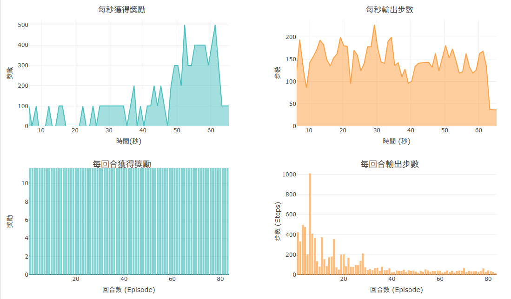
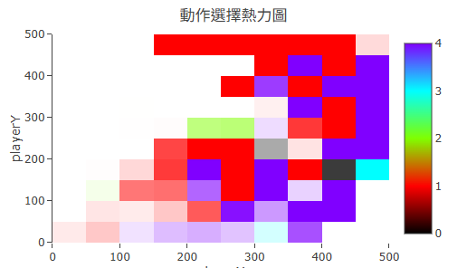
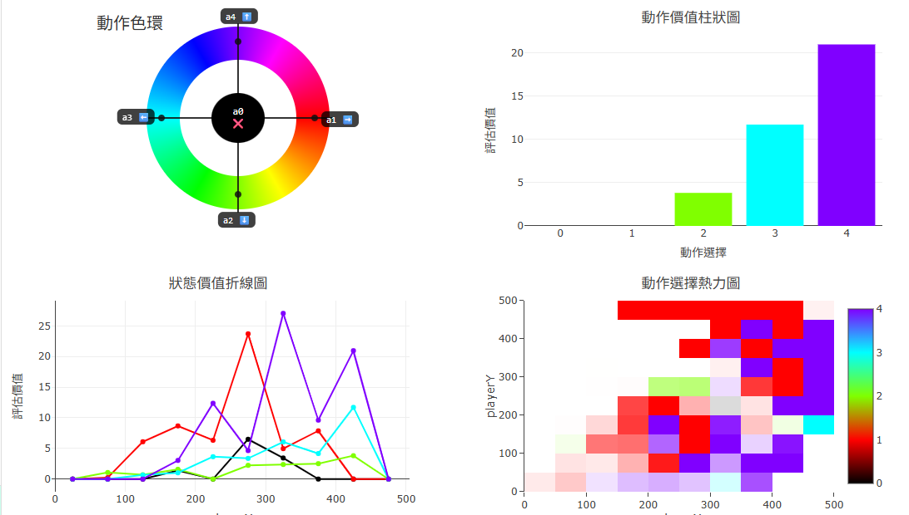
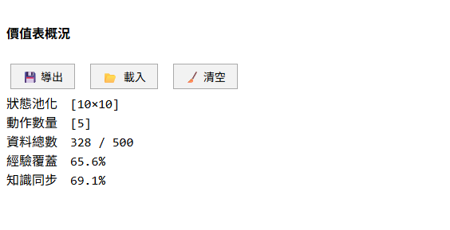

### **3.3 視覺化模組**

視覺化是 RR 平台教學設計的核心環節。強化學習的學習歷程在傳統數值輸出中難以感知——一組不斷更新的 Q 值陣列對初學者幾乎不具意義，而「智能體正在進步」這件事，也很難從純數字的變化中直觀確認。RR 的視覺化模組因此圍繞兩個目標展開：**讓學習者即時感知「訓練是否有效」**，以及**讓學習者空間化地理解「策略長什麼樣子」**。本節分述兩大模組的設計：即時訓練圖表（3.3.1）與 Q-Table 分析頁（3.3.2）。

---

#### **3.3.1 即時訓練圖表（每秒/每回合 Reward & Steps）**

即時訓練圖表位於右側儀錶 Tab 的下半部，以 Plotly.js 實作，提供四張互補的動態折線/柱狀圖（見圖 3-7）。圖表依照時間粒度分為兩組：

**（一）每秒圖表（Second Charts）**

平台以固定的 1 秒間隔統計訓練進度，繪製**每秒累積報酬**與**每秒輸出步數**兩張面積折線圖（`fill: 'tozeroy'`）。橫軸為訓練開始後的經過秒數，縱軸分別為報酬加總與步數計數；每次更新後歸零，以呈現「當前這一秒的活動量」。為避免時間軸出現空隙，暫停期間不記錄資料，而是將計時起點向後平移，使時間軸在繼續訓練時保持連續。圖表採用滑動視窗，最多保留最近 60 秒的資料，確保畫面不因資料累積而失去可讀性。

每秒步數圖對教學的輔助意義在於：步數的高低直接反映智能體當前是否陷入迴圈、是否快速失敗（episode 重置頻率高）、或是否已能穩定地在任務中行動。學習者可從這張圖感受到「智能體目前有多活躍」，作為調整延遲毫秒數（訓練速度）的直觀依據。

**（二）每回合圖表（Episode Charts）**

每當遊戲環境回傳 `done: true`（回合結束），平台記錄當前回合的**累積報酬**與**總步數**，以柱狀圖依回合序號排列，分別以藍綠色（報酬）與橙色（步數）配色呈現。同樣採用滑動視窗，最多顯示最近 100 回合的資料。

這組圖表是「策略是否收斂」最直接的視覺指標：
- 累積報酬的**長期上升趨勢**，代表智能體愈來愈善於累積獎勵；
- 完成任務所需步數的**長期下降趨勢**，代表智能體的行動路徑愈來愈有效率。

兩者合稱「訓練儀表板」，即使學習者對演算法細節尚未完全理解，也能從圖形走勢判斷訓練是否朝正確方向前進，為後續調整超參數提供依據。

**圖 3-7　每秒與每回合即時訓練圖表**

---

#### **3.3.2 Q-Table 分析頁（熱力圖、動作價值柱狀圖、知識同步指標）**

Q-Table 分析頁位於右側的**🔬分析 Tab**，以多種空間視覺化方式呈現 Q-Table 的內部知識結構。所有圖表每秒自動更新一次，讓學習者能邊訓練邊觀察策略的形成過程。

**（一）觀測基準點（focusState）與掃描維度**

分析頁的所有圖表共用一組控制變數：**觀測基準點（focusState）** 與**掃描維度（cutX、cutY）**。

- **focusState** 代表「目前正在觀測哪一個狀態」。分析頁提供「跟隨模式」與「手動模式」兩種設定：跟隨模式下，focusState 自動同步至智能體當前所在的狀態，學習者可即時看到智能體此刻的 Q 值分佈；手動模式下，每個狀態維度各有一條滑桿，滑桿值對應桶中心的真實物理值（例如 CartPole 的車速 −4.5 m/s），學習者可自由指定任意狀態進行觀測。
- **cutX、cutY** 由下拉選單控制，決定熱力圖與折線圖沿哪兩個狀態維度掃描，其餘維度固定在 focusState 對應的值（切片）。此設計讓高維狀態空間（如 CartPole 的 4 維）也能以二維熱力圖呈現，只需選擇要觀察的兩個維度即可。

**（二）動作色環**

分析頁頂部的**動作色環**（見圖 3-8 左上）以圓形指針圖呈現各動作的配色對應關係：動作 0（無動作）以黑色置於中心，其餘動作依 HSV 色環等角分佈。色環與所有熱力圖的配色完全一致，讓學習者能直接以顏色識別熱力圖中的動作偏好，不需反覆查表。

**（三）動作選擇熱力圖（含確信度遮罩）**

**動作選擇熱力圖**（Action Heatmap，見圖 3-8）是分析頁最核心的視覺化元件。它以 cutX × cutY 為座標軸，對狀態空間中的每個格子查詢其最優動作（$\arg\max_a Q(s, a)$），以對應的動作色彩填色，呈現「在哪個狀態下智能體傾向採取哪個動作」的全局策略地圖。

熱力圖疊加了一層**白色確信度遮罩**：每個格子的遮罩不透明度由該格子最優動作與次優動作的 Q 值差距（$\Delta Q = Q_{\text{best}} - Q_{\text{2nd}}$）決定——差距愈大，遮罩愈透明，顏色顯示愈清晰（策略確定）；差距愈小，遮罩愈白（策略不確定或尚未探索）。基準差距 `gapMax = 10` 為滿透明閾值。

此設計讓學習者能一眼看出：
- 哪些狀態區域策略已清晰確立（色彩鮮明）；
- 哪些區域仍「尚未決定」（泛白），提示智能體需要更多探索。

**（四）動作價值柱狀圖**

**動作價值柱狀圖**（Q-Bar Chart）以 focusState 為觀測點，以長條圖呈現該狀態下所有動作各自的 Q 值高低，顏色與動作色環一致。學習者可搭配跟隨模式，即時觀察智能體當前所在狀態的各動作評估值，或切換至手動模式，比較特定狀態下各動作的相對優劣——例如「站在迷宮入口時，向右走的 Q 值是否高於向左走？」

**（五）狀態價值折線圖**

**狀態價值折線圖**（Q-Line Slice）沿 cutX 維度掃描，固定其他維度，繪製各動作 Q 值隨該維度變化的折線。每條動作對應一條折線，配色與色環一致。此圖特別適合觀察**單一維度與策略的關係**，例如在 Maze1D 中，隨著位置索引（格子編號）增加，「向右移動」的 Q 值是否持續升高？此類折線的形狀提供了策略梯度的直觀感受，有助於學習者理解「狀態距離目標愈近，該動作被評估愈高」的語意。

**（六）最大 Q 值熱力圖與最小 Q 值熱力圖**

這兩張熱力圖以連續數值而非離散動作色彩呈現狀態空間的價值分佈：

- **最大 Q 值熱力圖**（見圖 3-9 左）：每個格子的顏色代表 $\max_a Q(s, a)$，配色為青→白→橙（負→零→正）。高亮的橙色區域代表「智能體認為在此狀態下未來可獲得較高報酬」，即高價值狀態；青色區域代表負價值狀態（通常是陷阱或高懲罰區域）。
- **最小 Q 值熱力圖**：以 $\min_a Q(s, a)$ 填色，配色為藍→白→紅，反映「最差動作的 Q 值」，可視為各狀態的風險指標——藍色區域代表即便採取最糟的動作也不會有太大損失，而紅色區域代表某個動作在此狀態下可能帶來特別大的損失，通常為陷阱旁邊的格子。

兩張圖合讀，可讓學習者直觀感受任務的「高報酬地形」與「風險地形」，而不必逐格翻查 Q-Table 數值。

**圖 3-8　動作色環與動作選擇熱力圖（Maze2D 訓練後）**

**圖 3-9　最大 Q 值熱力圖與動作價值柱狀圖**

**（七）知識同步率圖表（DQN 模式）**

當切換至 DQN 演算法模式時，儀錶 Tab 的訓練圖表區額外顯示一條**知識同步率（R²）折線圖**（見圖 3-10）。每個 episode 結束後，平台計算神經網路預測值與 Q-Table 現有值之間的決定係數 R²，記錄為一個時間點並繪製折線。

R² 值反映兩件事的動態平衡：一方面，Q-Table 持續從環境互動中更新，是「移動的靶」；另一方面，神經網路每回合 `fit` 一次追趕 Q-Table。若 R² 持續上升並趨近 1，代表神經網路已有效吸收 Q-Table 的知識；若 R² 在高水平後驟降，通常代表 Q-Table 剛發生了大規模的更新（例如探索到新的高獎勵路徑），神經網路需要幾個 episode 才能重新追上。此動態過程本身即是一個有趣的教學觀察點，讓學習者具體感受「表格知識」與「神經網路知識」之間的落差與收斂。

**圖 3-10　DQN 模式下的知識同步率指標**

---
