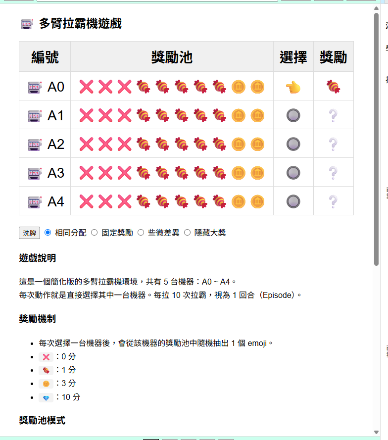
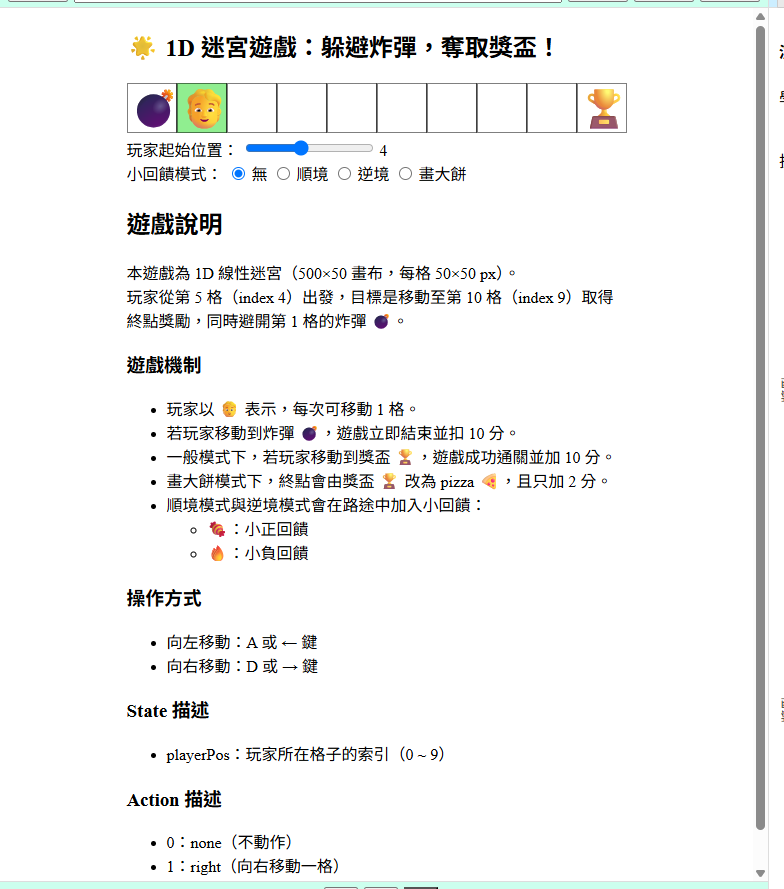
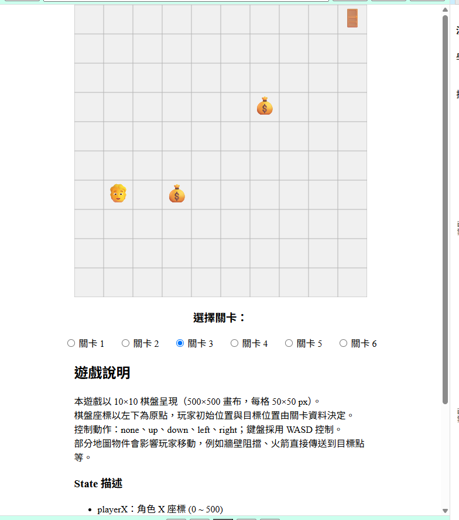
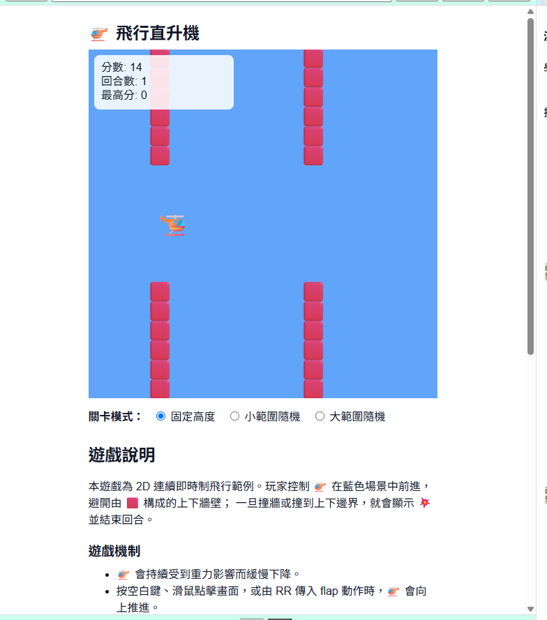
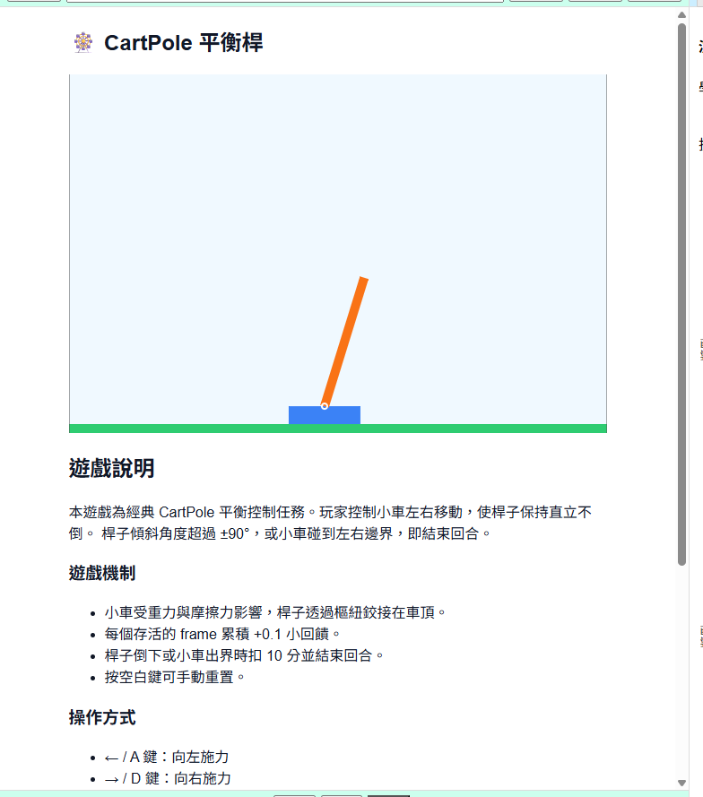

### **3.4 遊戲環境**

RR 平台的任務環境（遊戲）以獨立網頁的形式存在，透過 3.1.2 節描述的通訊協定與平台互動。本節首先說明遊戲環境在通訊協定中的具體實作規範（3.4.1），再逐一介紹五個官方主推任務環境的設計細節（3.4.2）。

---

#### **3.4.1 通訊協定：遊戲端實作規範**

3.1.2 節從平台的角度描述了訊息格式；本節補充**遊戲開發者**在實作環境時需遵循的規格細節。

**（一）gameInfo：宣告狀態空間與動作空間**

遊戲在收到平台的 `questInfo` 後，需立即回傳 `gameInfo`，其核心欄位為 `stateInfo` 與 `actionInfo`：

```javascript
// 範例：二維迷宮的 gameInfo
window.parent.postMessage({
  type: 'gameInfo',
  players: [{
    stateInfo: [
      { name: 'playerX', min: 0, max: 500, bin: 10 },
      { name: 'playerY', min: 0, max: 500, bin: 10 }
    ],
    actionInfo: [
      { type: 'switch', level: 5, name: ['⬜無','⬆️上','⬇️下','⬅️左','➡️右'] }
    ]
  }]
}, '*');
```

`stateInfo` 為陣列，每個元素描述一個狀態維度：
- `name`：維度名稱，顯示於分析頁的軸標與滑桿標籤
- `min` / `max`：該維度的物理數值範圍，供平台計算桶寬
- `bin`：該維度的分桶數量 $N$，決定 Q-Table 在此維度的解析度

`actionInfo` 亦為陣列（多智能體預留），每個元素描述一組動作空間：
- `type: 'switch'`：離散動作（目前唯一支援的類型）
- `level`：動作數量
- `name`：各動作的顯示名稱，用於生成動作按鈕標籤

**（二）reward_state：每步回傳**

每當平台送出 `action` 後，遊戲需執行一步模擬並回傳 `reward_state`：

```javascript
window.parent.postMessage({
  type: 'reward_state',
  reward: reward,        // 本步獲得的即時報酬（含終局懲罰）
  state: currentState,  // 狀態向量（陣列，長度與 stateInfo 一致）
  done: false,          // true = 本回合結束
  sessionId: currentSessionId  // 原封不動帶回 questInfo 取得的 id
}, '*');
```

重要設計規範：
- `done: true` 時，`reward` 必須已包含終局懲罰（而非分兩步傳）。
- 每次平台呼叫「載入」後 `sessionId` 遞增；遊戲帶回舊的 `sessionId` 時，平台自動忽略，避免跨 session 資料污染。
- 遊戲不應主動推送 `reward_state`，而是被動地在每次收到 `action` 後才回傳一次，確保訓練步調由平台控制。

**（三）環境設計原則**

官方遊戲在設計時遵循以下原則，以保持教學可用性：

1. **獎勵稀疏性由環境負責**：每步小回饋（如存活 +0.01）由遊戲端加入，讓初學者在稀疏獎勵情境下也能觀察到學習訊號。
2. **狀態語意對應物理量**：狀態向量使用可解釋的物理單位（位置、速度、角度），而非特徵工程後的抽象數值，方便學習者從熱力圖的軸標理解意義。
3. **難度分層**：多個遊戲提供難度切換選項（如 Maze1D 的回饋模式、heli 的關卡模式），讓教師能依學習進度調整任務難度。

---

#### **3.4.2 主要任務環境**

RR 目前收錄五個官方主推遊戲環境，依任務複雜度由低至高排列。

**（一）多臂拉霸機（MAB）**

多臂拉霸機（Multi-Armed Bandit，MAB）是強化學習理論中最簡化的情境：智能體不需考慮狀態轉移，每步直接選擇一台機器並獲得隨機報酬，目標是發現報酬最高的機器並持續選擇。

| 項目 | 規格 |
|------|------|
| 狀態維度 | 1 維（`selectedMachine`，0～4，代表上一步選擇的機台） |
| 動作空間 | 5（A0～A4，分別對應 5 台機器） |
| 回合長度 | 固定 10 步為一回合 |
| 報酬符號 | ❌（0分）、🍬（1分）、🪙（3分）、💎（10分） |

本環境提供四種獎勵池模式（見表 3-2），讓教師在不同教學目的下調整任務難度：

**表 3-2　MAB 獎勵池模式**

| 模式 | 設計 | 教學目的 |
|------|------|----------|
| 相同分配 | 五台機器獎勵池完全相同 | 展示均等探索情形，說明「無差異環境」 |
| 固定獎勵 | 兩台全❌、兩台全🍬、一台全🪙 | 最易收斂，適合入門說明探索/利用折衝 |
| 些微差異 | 機器間獎勵差距小 | 考驗智能體辨識細微差異的能力 |
| 隱藏大獎 | 四台普通，一台藏有 💎 池 | 展示 ε 偏低時可能錯過稀有最優機台 |

由於 MAB 的狀態僅為「上一步選了哪台機器」，Q-Table 的學習本質上退化為「各動作的平均報酬估計」，是向學習者說明 Q 值語意（「這個動作長期平均能拿到多少分？」）最直接的切入點。



**圖 3-11a　多臂拉霸機（MAB）環境**

**（二）一維迷宮（Maze1D）**

一維迷宮將環境簡化為一條長度 10 格的線性軌道，左端為炸彈（懲罰），右端為獎盃（目標）。智能體從第 5 格出發，每步可選擇向左、向右或不動。

| 項目 | 規格 |
|------|------|
| 狀態維度 | 1 維（`playerPos`，格子索引 0～9） |
| 動作空間 | 3（不動 / 向右 / 向左） |
| 終局條件 | 踩到炸彈（−10 分）或到達獎盃（+10 分） |

本環境提供四種小回饋模式，用於說明中間獎勵（intermediate reward）對學習的影響：
- **無**：路途中無任何中間回饋（純稀疏獎勵）
- **順境**：路途中散布正向小回饋（🍬），引導智能體向右探索
- **逆境**：路途中散布負向障礙（🔥），增加探索阻力
- **畫大餅**：終點改為較低獎勵的 🍕（+2 分），說明獎勵設計不當對策略的誤導

Maze1D 的狀態空間僅有 10 格，Q-Table 完全展開只有 10 × 3 = 30 個 Q 值，適合在分析頁的「狀態價值折線圖」中完整呈現整條軌道的策略梯度，讓學習者清楚看見「離目標愈近，向右走的 Q 值愈高」的收斂過程。



**圖 3-11b　一維迷宮（Maze1D）環境**

**（三）二維迷宮（Maze2D）**

二維迷宮以 10×10 棋盤呈現，以 p5.js 繪製 emoji 風格畫面（見圖 3-11c）。狀態空間擴展為二維座標，適合搭配分析頁的動作選擇熱力圖，讓學習者「俯視」策略地圖。

| 項目 | 規格 |
|------|------|
| 狀態維度 | 2 維（`playerX`、`playerY`，像素座標 0～500） |
| 動作空間 | 5（不動 / 上 / 下 / 左 / 右） |
| 關卡數量 | 6 關（由簡單空曠到含牆壁、陷阱、傳送點等障礙物） |

各關卡的地圖元素及其效果如下：

| 元素 | 效果 |
|------|------|
| `#` 牆壁 | 阻擋移動（原地不動） |
| `C` 金幣 | 小正回饋 |
| `F` 火焰 | 負回饋 |
| `B` 炸彈 | 大懲罰，結束回合 |
| `S` 火箭 | 直接傳送至目標點 |
| `T` 目標 | 大正回饋，結束回合 |

二維狀態空間使 Q-Table 的動作選擇熱力圖能以真正的二維地圖形式呈現，是分析頁視覺化最直觀、最具教學價值的任務環境。充分訓練後，熱力圖中的動作顏色分佈應形成明顯的「流向」，引導智能體從任意位置朝目標前進。



**圖 3-11c　二維迷宮（Maze2D）環境**

**（四）飛行直升機（heli）**

heli 是一個連續即時制的二維飛行環境，概念類似 Flappy Bird：直升機（🚁）受重力持續下降，平台每步傳送「flap（向上推進）」或「none（不動作）」，目標是控制飛行高度穿越由紅色方塊構成的牆壁開口。

| 項目 | 規格 |
|------|------|
| 狀態維度 | 3 維（`heliY`、`wallDistance`、`gapCenterY`） |
| 動作空間 | 2（不動作 / 向上推進） |
| 存活回饋 | 每步 +0.01 |
| 終局條件 | 撞牆或觸碰邊界（−10 分） |

三個狀態維度的物理意義：
- `heliY`：直升機目前高度（以畫面中心為 0，正上方最大 +250）
- `wallDistance`：下一組牆壁到直升機的水平距離
- `gapCenterY`：下一組牆壁開口的中心高度

本環境提供三種關卡模式，難度依序遞增：開口高度固定（最易）、小範圍隨機（±100）、大範圍隨機（±200）。

heli 是唯一採用**即時制**（real-time）的環境，每幀（frame）由 p5.js 驅動。訓練時智能體需要在連續的時間流中持續做決策，不像回合制任務可以無限等待，因此加速模式在此環境的效果尤為顯著。作為三維狀態的任務，heli 也適合用來示範 Q-Table 切片工具的用途——學習者可固定 `wallDistance`，觀察在特定距離下 `heliY` 與 `gapCenterY` 的相對位置如何影響 flap 的 Q 值。



**圖 3-11d　飛行直升機（heli）環境**

**（五）CartPole 平衡桿**

CartPole 是強化學習領域的經典基準任務，以 Matter.js 物理引擎實作真實的剛體動力學：小車在水平軌道上滑動，頂部透過鉸接樞紐連接一根倒立桿，智能體需透過對小車施加左右力量，使桿子保持直立不倒。

| 項目 | 規格 |
|------|------|
| 狀態維度 | 4 維（`cartX`、`cartVelX`、`poleAngle`、`poleAngularVel`） |
| 動作空間 | 3（不施力 / 向左施力 / 向右施力） |
| 存活回饋 | 每幀 +0.1 |
| 終局條件 | 桿子傾斜超過 ±90° 或小車出界（−10 分） |

四個狀態維度的物理範圍與 `gameInfo` 中宣告的分桶設定如下：

**表 3-3　CartPole stateInfo 規格**

| 維度 | 物理意義 | 宣告範圍 | 分桶數 |
|------|----------|----------|--------|
| `cartX` | 小車中心 X 座標（px） | 0 ～ 600 | 6 |
| `cartVelX` | 小車水平速度 | −20 ～ 20 | 6 |
| `poleAngle` | 桿子傾斜角（rad） | −1.57 ～ 1.57 | 6 |
| `poleAngularVel` | 桿子角速度 | −10 ～ 10 | 6 |

CartPole 以**原始物理值**直接傳送狀態，不在遊戲端做任何前處理，歸一化由平台的離散化邏輯處理。各維度均採用 6 個分桶（bin=6），使 Q-Table 的總狀態數為 $6^4 = 1296$ 格；對表格式 Q-Learning 而言，此規模在課堂訓練時間內可達到有意義的收斂，同時保持足夠的分辨率區分不同的平衡狀態。

CartPole 的 4 維狀態是五個環境中維度最高的，在分析頁中最能展現「切片觀測」的必要性：一次只能顯示二維截面，學習者需要選擇感興趣的兩個維度（例如固定 `cartX` 與 `cartVelX`，觀察桿子角度與角速度的策略圖），培養對高維策略空間的空間想像能力。



**圖 3-11e　CartPole 平衡桿環境**

---

**五個環境的橫向比較**

表 3-4 對五個官方環境從教學角度做橫向比較，供教師依課程目標選擇任務：

**表 3-4　RR 官方環境比較**

| 環境 | 狀態維度 | 動作數 | 時間制 | Q-Table 規模 | 主要教學重點 |
|------|----------|--------|--------|--------------|-------------|
| MAB | 1D | 5 | 回合制 | 5 × 5 = 25 | 探索/利用折衝、Q 值語意 |
| Maze1D | 1D | 3 | 回合制 | 10 × 3 = 30 | 稀疏獎勵、策略梯度可視化 |
| Maze2D | 2D | 5 | 回合制 | 10×10 × 5 = 500 | 空間策略地圖、獎勵塑形 |
| heli | 3D | 2 | 即時制 | 數千格 | 連續決策、切片觀測 |
| CartPole | 4D | 3 | 即時制 | $6^4 × 3 = 3888$ | 高維狀態、物理平衡控制 |

---
