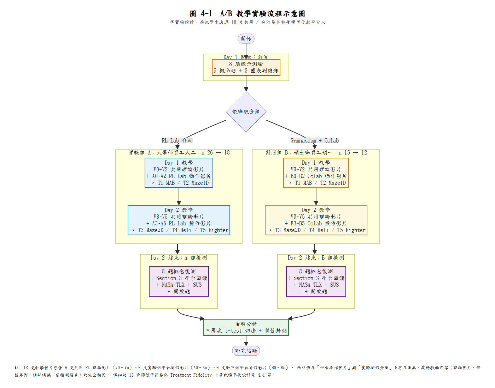

## 4.2 A/B 教學實驗流程設計

本研究為檢驗不同強化學習教學介面（RR 平台與 Gymnasium＋Colab）對學生學習成效之影響，採取**準實驗研究（quasi-experimental design）**中之 A/B 教學實驗設計。兩組學生皆接受相同之強化學習概念教學內容（透過 18 支標準化教學影片中的 6 支共用 RL 理論影片）、相同之任務題材（MAB → Maze1D → Maze2D → Heli → Fighter 五個任務序列），唯在「實作與觀察」階段分別使用不同教學平台，以此作為自變項，檢驗其對學習成果之影響。

為使後續分析清楚，本節將分別說明實驗設計型態、整體流程與控制變項之考量，並輔以流程圖示意。


### 4.2.1 實驗設計型態

本研究採用**兩組前後測準實驗設計**（two-group pretest–posttest quasi-experimental design），RR 組與 Colab 組分別對應兩種不同教學介面：

**RR 組（A）**：

主要教學實作介面為本研究開發之 **RR 平台**。

學生透過任務選單依序進入 MAB（多臂拉霸機）、Maze1D（一維迷宮）、Maze2D（二維迷宮）、Heli（直升機飛行）與 Fighter（太空射擊）等任務，使用滑桿調整超參數，並觀察即時學習曲線與 Q-table 熱力圖。

**Colab 組（B）**：

主要教學實作介面為 **Gymnasium 搭配 Google Colab**。

學生在 Notebook 中操作預先設計的程式碼，透過自製的 `rr_envs.py` 環境模組（與 RR 五個遊戲環境完全對齊）執行相同的五個任務，調整程式中的超參數變數重新執行，並透過 matplotlib 繪製回合報酬與步數變化圖。

兩組學生皆透過 18 支標準化 AI 影片接收教學內容（其中 6 支 RL 理論影片完全共用，另各 6 支為平台操作影片），授課人員依預先撰寫之講師講稿宣讀，教學內容包含：

強化學習基本概念（狀態、動作、報酬、回合、探索與利用、折扣因子等）。

完全相同的五個任務序列（MAB → Maze1D → Maze2D → Heli → Fighter）。

圖表判讀與學習歷程解讀的練習。

差異僅在於「介面與互動方式」：一組透過網頁視覺化平台（RR），一組透過程式碼與 Notebook（Gymnasium＋Colab）。教學內容、任務題材與授課語言（英語）皆透過影片標準化，相關設計細節詳見 4.4.4 節「教學介入標準化」。


### 4.2.2 教學實驗流程

整體實驗流程如圖 4-1 所示，主要分為「前測」、「教學介入」與「後測與資料蒐集」三大階段。



**前測階段**

時間安排：Day 1 課程開始的前 30 分鐘。

實施內容：

**強化學習概念前測**：以 Google Form 線上施測，含 5 題概念選擇題（state/action/reward/episode、探索與利用、Q 值、貪婪策略等）與 3 題圖表判讀題（reward 曲線判讀、Q-table 熱力圖判讀），共 8 題、總分 8 分。

**學生背景資料**：學號、程式經驗、強化學習先備知識自評。

目的：確認兩組學生在實驗介入前之概念理解與圖表判讀能力，並作為後續計算「進步量」之基準。

**教學介入階段**

每組教學介入安排為兩天課程（Day 1 與 Day 2），每天 14:10–17:00（共約 6 小時實作時間）。RR 組於 4/22（Day 1）與 4/29（Day 2）進行；Colab 組於 4/21（Day 1）與 4/28（Day 2）進行。

兩組共同採用 13 步驟標準化教學節奏（詳見 4.4 節）：

```
[共用理論影片] → [平台操作示範影片] → [學生自操 + 助教記錄]
```

兩組教學任務序列完全相同：

| 任務 | 階段 | 主要學習目標 |
|------|------|------------|
| T1 MAB | Day 1 | 探索與利用權衡、ε 比較 |
| T2 Maze1D | Day 1 | SAR 循環與 Bellman 更新 |
| T3 Maze2D | Day 2 | Q-table 熱力圖與策略地圖 |
| T4 Heli | Day 2 | 訓練曲線判讀（主要評量任務） |
| T5 Fighter | Day 2 | **不給預設超參數，自主設定**（自主操作能力評量） |

**RR 組（RR）介入流程概述**：

學生依 README 步驟序列依序觀看共用理論影片（V0–V5）與 RR 操作示範影片（A0–A5），並在 RR 平台上完成五個任務的操作。所有滑桿設定與訓練曲線均在瀏覽器中即時呈現，學生透過調整 α、γ、ε 等超參數，觀察代理人行為與學習曲線的變化。在 Maze2D 任務中，學生練習從 Q-table 熱力圖中讀取「在不同位置應該採取的最佳行動」；在最終的 Fighter 任務中，學生需在無預設超參數的情況下，自行決定參數設定。

**Colab 組（Gymnasium＋Colab）介入流程概述**：

學生依 README 步驟序列依序觀看共用理論影片（V0–V5）與 Colab 操作示範影片（B0–B5），並在 Google Colab（或 Binder 備援平台）上執行與 RR 完全對齊的 Python 環境模組（`rr_envs.py`）。學生透過修改 notebook 中標記為 🔧 的參數區塊重新執行，並透過 matplotlib 繪製的學習曲線觀察參數對訓練表現的影響。在最終的 Fighter 任務中，學生同樣需在無預設超參數的情況下，自行決定參數設定。

**後測與資料蒐集階段**

時間安排：Day 2 課程結束前 30 分鐘。

實施內容：

**強化學習概念後測**：題目結構與前測完全相同的 8 題（5 概念 + 3 圖表判讀），用以量化學習成效。

**Section 3 平台回饋**：5 題 Likert 量表（1–5 分），涵蓋介面易用、參數信心、視覺化幫助、學習動機、推薦意願。

**NASA-TLX 心智負荷量表**：6 題（1–10 分），涵蓋心智需求、體力需求、時間壓力、表現自評、努力程度、挫折感。

**SUS 系統易用性量表**：10 題標準題目（1–5 分，正反向交替），轉換為標準 SUS 百分制。

**開放題**：3 題（最有幫助的部分、最困難的部分、其他建議）。

**任務完成記錄**：由助教依任務完成記錄表記錄各學生五個任務的完成時間戳記。

**課堂觀察記錄**：助教依課堂觀察記錄表記錄出席人數、教學進度、學生互動觀察與任務參與度評估。


### 4.2.3 控制變項與內部效度考量

為提高本研究之內部效度，在實驗流程設計中，除自變項「教學介面」之外，其餘可能影響學習成效之因素皆透過系統化的標準化措施予以控制，說明如下：

**教學介入標準化（Treatment Fidelity）** 本研究最重要的內部效度設計為**教學介入的多層次標準化**：

- **18 支 AI 影片**：6 支共用 RL 理論影片由兩組共同觀看，確保兩組接收完全相同的理論教學內容；另各 6 支平台操作影片，由研究者親自編寫腳本，AI 負責語音與視覺呈現，消除不同教師講課語速、語氣、表達風格的差異。

- **預先撰寫的講師講稿**：兩組各自的講師講稿（A 組 410 行、B 組 378 行）採英文照念設計，配合中文【動作】提示，確保課堂宣讀內容一致。

- **標準化學生指引（README）**：兩組學生分別獲得 GitHub repository（rl-lab-group-a / rl-lab-group-b），README 中按 13 步驟編號排列影片連結與任務指引，確保每位學生接收的學習路徑一致。

完整設計細節詳見 4.4.4 節。

**教學內容與時數一致** 兩組學生接受的 RL 理論影片完全相同（V0–V5 共 6 支），任務序列完全相同（T1 MAB → T2 Maze1D → T3 Maze2D → T4 Heli → T5 Fighter），總課時數均為 2 天 × 約 3 小時，前後測題目完全相同。

**教材設計的對齊** Colab 組所使用之 `rr_envs.py` Python 模組將 RR 五個遊戲環境的獎勵函式、狀態空間與終局條件完全複製至 Gymnasium 介面，確保兩組面對的「任務本質」相同。如此安排可避免「Colab 組任務太難或太簡單」成為干擾因素。

**雙平台 redundancy 配置** Colab 組同時部署於 Google Colab 與 mybinder.org 兩個平台（內容完全相同），作為實驗當天單一平台失靈時的備援。

**設備與環境條件** 兩組皆在學校電腦教室進行，使用相同或相近規格之電腦與網路環境。

**技術問題之協助與限制** 助教在兩組中皆提供必要之技術協助，但在「解題策略或概念推導」上，則嚴格避免給予額外提示，以維持教學介入的一致性。


綜合而言，本節所述 A/B 教學實驗流程設計，藉由系統化的影片、講稿、文件與環境標準化，使「教學介面差異」成為兩組之間唯一系統性差異變項。後續第 4.3 節將進一步說明實驗對象與分組方式，第 4.4 節則詳細描述各節課程中實際操作 RR 與 Gymnasium 之教學流程與教材使用方式（其中 4.4.4 節將詳述 Treatment Fidelity 設計），第 4.5、4.6 節則分別說明評估工具與數據分析方法。