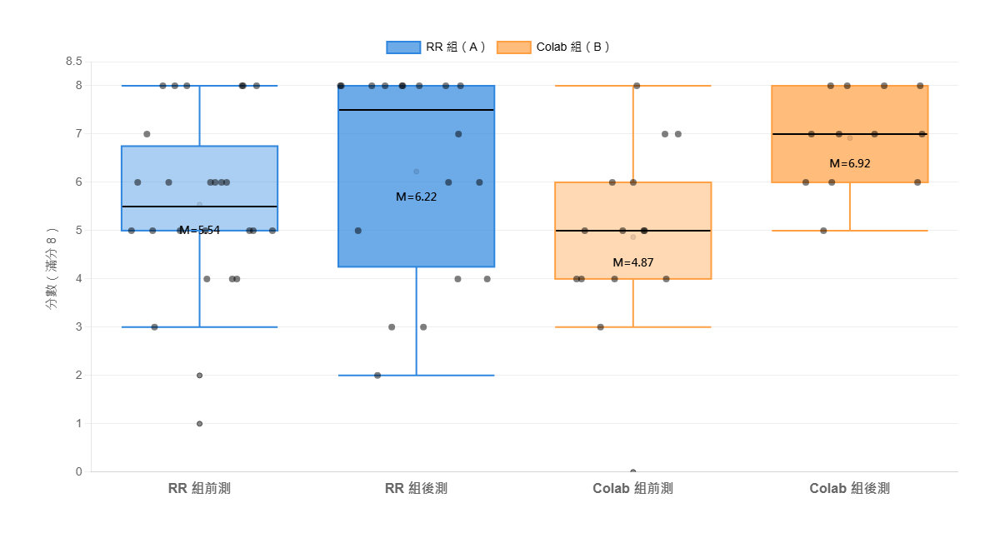
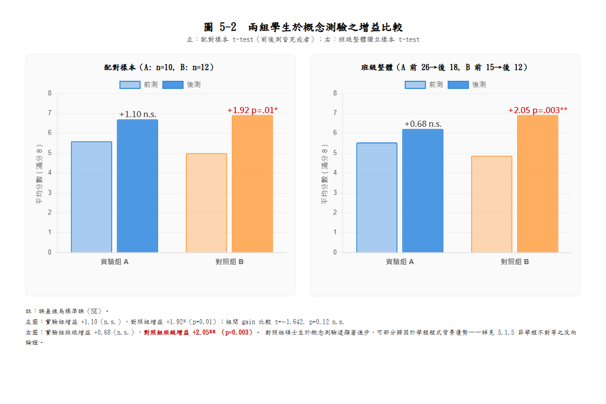

## 5.1 RL 概念理解測驗分析

本研究以「RL 概念理解測驗」作為核心量化成效指標，透過課前（Pre-test）與課後（Post-test）兩次測驗，評估受試者在強化學習基礎概念上的理解提升程度，並比較不同教學平台與教材介入（實驗組：RL Lab；對照組：Gymnasium + Colab）對概念學習的影響。測驗題目設計聚焦於初學者最關鍵且能跨平台通用的概念，包括：state / action / reward（SAR）三要素、episode 的意義、探索與利用（exploration vs exploitation）的權衡、Q 值（state-action 價值）之基本理解，以及訓練曲線（reward 隨 episode 變化）與 Q-table 熱力圖之基礎判讀能力。由於本研究旨在比較不同教學媒介的教學支架與操作門檻，而非比較題目難度或高階數學推導，因此採用入門層次之題項以提高可作答性與測量穩定性。

### 5.1.1 測驗設計與評分方式

RL 概念理解測驗共計 **8 題**，皆為單選題（每題 4 個選項），每題答對得 1 分、答錯得 0 分，總分範圍為 0～8 分。題目分為兩部分：

| 部分 | 題數 | 題目主題 |
|------|------|---------|
| 概念題（Section 1） | 5 題 | state、episode、ε-greedy、Q(s,a) 定義、greedy-only 風險 |
| 圖表判讀題（Section 2） | 3 題 | Reward 曲線解讀、兩條曲線的學習率比較、Q-table 熱力圖判讀 |

為降低題目之外的干擾因素（如寫作能力差異），本研究以客觀計分為主，前後測使用完全相同的題目（題序與選項順序皆相同），使前後測結果能反映受試者在同一概念集合上的變化。前後測配對以受試者填寫之 Student ID 進行，惟因部分學生在前後測填寫時格式略有不一致（例如大小寫差異、是否包含前綴 S），本研究對 Student ID 進行格式正規化後再進行配對。施測平台為 Google Form，前測於 Day 1 課堂開始前 30 分鐘內完成，後測於 Day 2 課堂結束前 30 分鐘內完成。

在資料處理上，本研究排除一筆研究者用於測試 Google Form 系統的測試資料（Student ID = s1136103，前後測皆有出現）。最終有效樣本如下：

| | 實驗組 A（RL Lab） | 對照組 B（Gymnasium + Colab） |
|--|------------------|-----------------------------|
| 前測有效人數 | 26 | 15 |
| 後測有效人數 | 18 | 12 |
| 配對前後測樣本 | 10 | 12 |

實驗組之配對樣本數明顯少於前測人數，主要原因為 Day 2 課堂出席人數較 Day 1 減少 8 人（attrition rate 31%）。對照組 attrition rate 較低（13%）。本節後續分析將同時呈現「**配對樣本（paired sample）**」與「**班級整體（class-level）**」兩種統計切法，以提供不同詮釋角度並避免單一統計策略可能造成的結論偏誤。

### 5.1.2 分析策略與統計方法

本節分析目的可分為三個層次：（1）確認兩組在介入前的起點是否相近；（2）檢驗各組在介入後是否提升；（3）比較兩組提升幅度是否存在差異。為對應上述目的，本研究採用描述統計與推論統計搭配呈現。

統計顯著水準設定為 α = .05，p < .05 標記為顯著（\*）、p < .01 標記為高度顯著（\*\*）、p ≥ .05 標記為未達顯著（n.s.）。考量本研究樣本數偏小（單組 n ≤ 26），單以 p 值判斷可能受檢定力不足影響，因此本研究同步報告**效果方向（effect direction）**與描述統計平均數差異，作為小樣本研究的補充判讀依據。本研究採用之統計方法為配對 t-test（組內前後比較）與獨立樣本 t-test（組間比較），統計分析以 Python 之 SciPy 套件實作（`scipy.stats.ttest_rel` 與 `scipy.stats.ttest_ind`）。

### 5.1.3 前測同質性檢驗（介入前起點比較）

為確保實驗設計具可比性，本研究首先比較兩組受試者在前測分數上的差異，以檢驗介入前起點是否一致。前測描述統計如表 5-1 所示：

**表 5-1　前測分數描述統計**

| 組別 | 人數 | 平均分數 (M) | 標準差 (SD) | 最低 | 最高 |
|------|------|-------------|------------|------|------|
| 實驗組 A | 26 | 5.54 | 1.88 | 1 | 8 |
| 對照組 B | 15 | 4.87 | 1.92 | 0 | 8 |

獨立樣本 t-test 結果顯示，兩組前測分數無統計顯著差異（t = +1.116, p = 0.27, n.s.）。實驗組平均略高於對照組約 0.67 分，但差距未達顯著。可視為兩組在介入前的概念理解程度具一定可比性。

值得注意的是，雖然兩組前測平均分數相近，但兩組學生的學位階段存在系統性差異——**實驗組為大學部資工大二生、對照組為碩士班資工碩一生**。對照組成員多具備較紮實的程式背景與較成熟的自主學習能力，但因強化學習為兩組學生皆未正式修習過的新領域，此學位階段差異未直接反映在前測概念分數上。此學位階段不對等將於後續組間比較與第六章討論時納入考量。

### 5.1.4 組內前後比較（各組是否學到）

針對配對樣本（前後測皆完成且 Student ID 可成功匹配者），本研究分別對兩組進行成對樣本 t-test。結果如表 5-2 所示：

**表 5-2　組內前後測配對 t-test 結果**

| 組別 | n | 前測 M (SD) | 後測 M (SD) | 增益 Δ | t 值 | p 值 | 顯著性 |
|------|---|------------|------------|--------|------|------|--------|
| 實驗組 A | 10 | 5.60 (1.96) | 6.70 (1.83) | +1.10 | +1.170 | 0.28 | n.s. |
| 對照組 B | 12 | 5.00 (2.49) | 6.92 (1.00) | +1.92 | +3.086 | 0.01 | \* |

**對照組 B 達統計顯著進步**（p = 0.01），平均分數從 5.00 / 8 提升至 6.92 / 8，增益 +1.92 分。**實驗組 A 之配對樣本則未達顯著**（p = 0.28），平均分數從 5.60 提升至 6.70，增益 +1.10 分。

實驗組未達顯著的可能原因有三：

1. **配對樣本數偏小（n = 10）**：相較於對照組 n = 12，實驗組可用於配對檢定的樣本不足，檢定力受限。
2. **天花板效應（ceiling effect）**：實驗組配對樣本之前測平均已達 5.60 / 8，部分學生（n=4）前測即拿到滿分 8 / 8，後測無進步空間。
3. **班級出席率下降**：實驗組 Day 2 出席較 Day 1 減少 8 人，剩餘配對樣本不一定能代表全班學習狀態。

為避免單一配對切法導致的結論偏誤，本研究進一步採班級整體獨立樣本 t-test 進行補充分析（見 5.1.5）。

### 5.1.5 組間成效比較

#### （一）配對樣本之增益比較

以每位受試者之增益分數（Gain = Post − Pre）進行兩組比較，獨立樣本 t-test 結果為 t = −1.642, p = 0.12, n.s.。實驗組平均增益 +1.10 分（SD = 1.79），對照組平均增益 +1.92 分（SD = 2.15），對照組增益略高於實驗組，但差距未達統計顯著。

#### （二）班級整體獨立樣本比較

考量配對樣本可能因 attrition 偏誤造成結果不穩定，本研究進一步以班級整體前測（n_A=26, n_B=15）與班級整體後測（n_A=18, n_B=12）進行獨立樣本 t-test。結果如表 5-3 所示：

**表 5-3　班級整體前後測獨立樣本 t-test 結果**

| 組別 | 前測 n / M / SD | 後測 n / M / SD | 班級增益 | t 值 | p 值 | 顯著性 |
|------|-----------------|-----------------|---------|------|------|--------|
| 實驗組 A | 26 / 5.54 / 1.88 | 18 / 6.22 / 2.16 | +0.68 | +1.116 | 0.27 | n.s. |
| 對照組 B | 15 / 4.87 / 1.92 | 12 / 6.92 / 1.00 | +2.05 | +3.344 | 0.003 | \*\* |

班級整體分析下，**對照組進步達高度顯著**（p = 0.003 \*\*），增益幅度更大（+2.05）；**實驗組仍未達顯著**（p = 0.27）。此結果排除了「實驗組未顯著是因配對樣本太小」的單一解釋，顯示實驗組的概念測驗增益本身就明顯小於對照組。

#### （三）學位階段不對等的反向論證

若僅以概念測驗結果觀察，將得出「Colab 平台帶來顯著進步、RL Lab 未達顯著」的初步結論。然而此單一指標解讀忽略了一個重要的背景因素——**兩組學生的學位階段並不對等**：

- **實驗組（RL Lab）**：大學部資工**大二**生（n = 26），多數學生為首次接觸強化學習，部分學生甚至首次接觸 Python 程式。
- **對照組（Gymnasium + Colab）**：碩士班資工**碩一**生（n = 15），多數已具備數年程式經驗、修畢機器學習相關課程，並具備自主閱讀程式碼與除錯之能力。

碩士生在標準化概念測驗上展現較大增益（+2.05 vs +0.68），合理可部分歸因於其較強的學習能力與程式基礎，而非單純 Colab 平台的優勢。換言之，**對照組的較佳概念測驗表現可能反映「學習者本身的能力差異」而非「平台介面的差異」**。本研究將於 5.2 節以行為層次的指標（任務完成率，特別是 T5 自主超參設定任務）進一步檢驗在排除學位階段差異影響後，平台介面本身對學習成效的獨立貢獻。

### 5.1.6 視覺化呈現

為使結果更直觀，本研究以圖表輔助呈現兩組前後測分佈與增益比較。建議呈現以下圖表：

### 5.1.7 小結

綜合配對樣本與班級整體兩種統計切法，本節結果可歸納為：

1. **兩組前測起點接近**（5.54 vs 4.87，p = 0.27 n.s.），具一定可比性。
2. **對照組（Colab）概念測驗達顯著進步**（配對 p = 0.01 \*；班級整體 p = 0.003 \*\*）。
3. **實驗組（RL Lab）概念測驗未達顯著進步**（配對 p = 0.28 n.s.；班級整體 p = 0.27 n.s.），原因可能包含天花板效應與配對樣本偏小。
4. **組間 gain score 差異未達顯著**（p = 0.12 n.s.），但描述統計上對照組增益較大。
5. **上述差異須結合學位階段一併解讀**：對照組為碩士生，本身具備較強程式背景與自主學習能力，其較佳的概念測驗表現可能反映學習者能力而非平台優勢。

值得指出的是，標準化概念測驗只能反映「學習者能否在選擇題中辨識正確答案」這一表層認知，無法測量學習者是否能將所學遷移至無預設指引的新情境。為更全面評估兩平台之教學成效，本研究於後續章節進行多面向的行為與情意指標分析：第 5.2 節透過任務完成率（特別是 T5「無預設超參數，自主設定」任務）檢視學習者的自主操作能力；第 5.3 節透過 Section 3 平台回饋、NASA-TLX 心智負荷與 SUS 系統易用性量表比較主觀學習感受；第 5.4 節則從課堂觀察記錄與開放題質性回饋探討教學現場的卡關點與學習動態。
