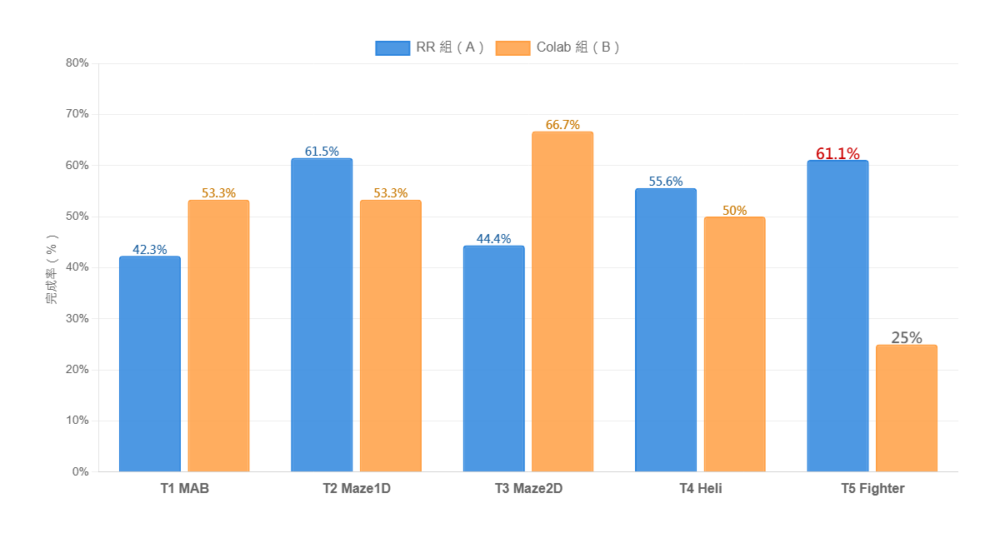

## 5.2 任務完成成效比較

本節從「實作表現」層面比較兩組受試者於課程任務中的完成情形。相較於 5.1 之理論知識測驗反映受試者對強化學習核心概念的辨識能力（選擇題層次），本節關注受試者於實際任務操作中的完成率與完成時間表現。為確保比較公平性，兩組採用完全相同的任務目標與序列（透過 4.4.4 節所述的環境對齊設計，Colab 組之 `rr_envs.py` 與 RR 之獎勵函式逐字對齊），差異主要來自於學習介面與教材媒介：RR 組使用 RR 平台以視覺化介面進行訓練與觀察；Colab 組使用 Gymnasium + Colab 以程式碼導向方式進行訓練與分析。

### 5.2.1 任務設計

本研究之教學任務序列共五項，依任務難度由低至高排列，於兩天課程中依序進行：

**表 5-4　五項教學任務之設計與定位**

| 任務 ID | 任務名稱 | 階段 | 主要學習目標 | 難度 |
|---------|---------|------|------------|------|
| T1 | MAB | Day 1 | exploration vs exploitation；ε 比較 | 入門 |
| T2 | Maze1D | Day 1 | state–action–reward loop；Bellman 更新 | 入門 |
| T3 | Maze2D | Day 2 | Q-table 熱力圖判讀；策略視覺化 | 中等 |
| T4 | Heli | Day 2 | reward 曲線判讀；連續狀態離散化（**主評量任務**）| 中高 |
| T5 | Fighter | Day 2 | **無預設超參數；自主設定 α、γ、ε** | 最高 |

T1 與 T2 引入 RL 基礎概念（SAR、ε-greedy、Q-learning），T3 引入空間策略視覺化，T4 引入連續狀態離散化（教師示範時提供預設超參數），T5 則於不給予預設超參數的條件下，要求學生獨立判斷 α、γ、ε 之設定。

### 5.2.2 資料來源與處理方式

任務完成資料由助教張鈞博依「任務完成記錄表」於兩組課堂中即時記錄。記錄方式為：學生完成任務後舉手，助教前往確認畫面（RR 組為 RR 之訓練曲線與 Q-table；Colab 組為 Colab 之 matplotlib 輸出），確認任務達成後在記錄表上填入完成時間（如 14:47）。未完成或助教未及記錄者欄位留白，本研究將留白處理為「未達成」，並於 5.2.5 節說明此處理方式的限制。

**完成率分母**：採用該天課程的實際出席人數——Day 1 任務（T1、T2）以前測有效人數為分母（A 組 = 26、B 組 = 15），Day 2 任務（T3、T4、T5）以後測有效人數為分母（A 組 = 18、B 組 = 12）。

**配對樣本對齊限制**：依 5.1 節採用之配對樣本邏輯（RR n = 10、Colab n = 12），本節之完成率與完成時間分析理應採用同一配對樣本以維持分析一致性。惟任務完成記錄表所用學生識別碼為助教所記學號，與後測問卷之學生自填代碼（部分為暱稱代碼）難以精確對應。為避免主觀對齊判斷引入額外偏誤，本研究於本節分析中仍以全班有效人數為分母。此資料對齊限制將於 5.2.5 節再次明確列出，提示讀者於跨節比較時注意樣本範圍之差異。

需另指出之事項：RR 組之名冊原列 40 人，但實際出席與完成記錄為 19 人，其餘 21 人於記錄表中欄位全空。此情形可能源自助教於 40 人班級中無法逐一即時確認，或部分學生實際未到課或未完成。本研究以前後測有效人數作為任務完成率分母，可降低（但無法完全排除）此因素對 RR 組完成率之低估影響。

### 5.2.3 任務完成率比較

兩組學生於五項任務上的完成情形如表 5-5 所示，並以卡方檢定（含期望次數小於 5 時改用 Fisher exact 檢定）進行兩組比較，效果量採用 Cramer's V。

**表 5-5　兩組各任務完成率比較**

| 任務 | 階段 | RR 組（A） | 完成率 A | Colab 組（B） | 完成率 B | 檢定 | p | Cramer's V | 顯著性 |
|------|------|-----------|---------|---------------|---------|------|---|-----------|--------|
| T1 MAB | Day 1 | 11 / 26 | 42.3% | 8 / 15 | 53.3% | 卡方 | .721 | .056 | n.s. |
| T2 Maze1D | Day 1 | 16 / 26 | 61.5% | 8 / 15 | 53.3% | 卡方 | .854 | .029 | n.s. |
| T3 Maze2D | Day 2 | 8 / 18 | 44.4% | 8 / 12 | 66.7% | 卡方 | .411 | .150 | n.s. |
| T4 Heli（主評量）| Day 2 | 10 / 18 | 55.6% | 6 / 12 | 50.0% | 卡方 | 1.000 | .000 | n.s. |
| T5 Fighter（自主超參）| Day 2 | 11 / 18 | 61.1% | 3 / 12 | 25.0% | 卡方 | .117 | .286 | n.s. |

五項任務之完成率於兩組間皆未達統計顯著差異（p ≥ .117）。各任務之描述差距與效果量如下：

**T1 MAB**：完成率 RR 組 42.3% 略低於 Colab 組 53.3%，差距約 11 個百分點，效果量 V = .056（小）。

**T2 Maze1D**：完成率 RR 組 61.5% 略高於 Colab 組 53.3%，差距約 8 個百分點，效果量 V = .029（小）。

**T3 Maze2D**：完成率 Colab 組 66.7% 高於 RR 組 44.4%，差距約 22 個百分點，效果量 V = .150（小）。Colab 組於 Day 2 因課程節奏緣故，T3 之講授時間延後至 16:19 才開始（距下課僅 41 分鐘），於時間壓力下仍達 66.7% 完成率。RR 組則因 Day 2 出席率下降與課堂目標感模糊（詳見 5.4 節質性觀察），完成率受限。

**T4 Heli（主評量任務）**：完成率 RR 組 55.6% 與 Colab 組 50.0% 接近，效果量 V = .000（兩組事實上於完成率上無差異）。

**T5 Fighter（自主超參數設定）**：完成率 RR 組 61.1% 高於 Colab 組 25.0%，描述差距達 36 個百分點，效果量 V = .286（中），惟於 n_A = 18、n_B = 12 之樣本規模下卡方檢定未達顯著（p = .117）。此中度效果量值得於後續較大樣本研究中進一步驗證。

### 5.2.4 任務完成時間比較

除「是否完成」之二元指標外，本研究亦對有完成記錄之學生進一步分析其完成耗時（學生填寫之完成時間 − 該任務助教說明完畢的開始時間，以分鐘為單位）。對每個任務分別以 Mann-Whitney U 檢定比較兩組之完成耗時，效果量採用 r = |Z| / √N。結果如表 5-6 所示：

**表 5-6　兩組各任務完成耗時比較（分鐘，Mann-Whitney U 檢定）**

| 任務 | RR n | RR M (SD) | Colab n | Colab M (SD) | U | p | 效果量 r | 顯著性 |
|------|------|-----------|---------|--------------|---|---|----------|--------|
| T1 MAB | 11 | 23.5 (11.2) | 8 | 48.4 (40.5) | 34 | .408 | .199 小 | n.s. |
| T2 Maze1D | 15 | 23.7 (14.5) | 8 | 23.8 (23.1) | 68 | .605 | .114 小 | n.s. |
| T3 Maze2D | 8 | 22.1 (8.9) | 8 | 17.1 (8.1) | 44 | .247 | .302 中 | n.s. |
| **T4 Heli（主評量）** | 10 | **17.6 (7.2)** | 6 | **53.0 (24.1)** | **0** | **.0013** | **.813 大** | **\*\*** |
| **T5 Fighter（自主超參）** | 11 | **20.4 (7.4)** | 3 | **33.3 (2.3)** | **0** | **.0115** | **.687 大** | **\*** |

各任務之完成耗時解讀如下：

**T1、T2、T3**：兩組完成耗時於 Mann-Whitney U 檢定下未達統計顯著差異。T1 雖描述差距較大（RR 23.5 分鐘 vs Colab 48.4 分鐘），但 Colab 組此項標準差較大（SD = 40.5），組內變異吸收了組間差距。

**T4 Heli（主評量任務）**：**RR 組（17.6 分鐘）顯著快於 Colab 組（53.0 分鐘），U = 0, p = .0013 \*\*，效果量 r = .813 為大效果**。此任務要求學生閱讀 reward 隨 episode 變化之曲線並判斷代理人是否成功學習；RR 組學生透過平台即時刷新的訓練曲線能於訓練過程中即時觀察成效，相較於 Colab 組需於程式執行完成後才能繪製靜態 matplotlib 圖表，操作回饋週期較短。

**T5 Fighter（自主超參數設定）**：**RR 組（20.4 分鐘）顯著快於 Colab 組（33.3 分鐘），U = 0, p = .0115 \*，效果量 r = .687 為大效果**。需特別說明：T5 之 Colab 組樣本僅 n = 3（與 5.2.3 完成率分母 12 中僅 3 人完成相對應），雖統計檢定達顯著且效果量大，因樣本規模極小，詮釋此結果時需注意其穩健性限制。

### 5.2.5 資料限制說明

任務完成記錄分析有三項主要資料限制：

1. **助教即時記錄之偏誤可能**：RR 組名冊 40 人中僅 19 人有完整記錄。雖本研究已改用前後測出席人數作為分母以降低此偏誤，部分學生可能實際完成任務但未被助教即時記錄到。此因素可能使 RR 組之完成率被低估。

2. **完成時間之記錄精度限制**：部分學生雖被記錄為「完成」，但完成時間欄位留白（無法納入完成時間 Mann-Whitney U 檢定）；另部分學生可能反覆訓練調整，記錄表僅記錄首次完成時間。

3. **配對樣本對齊限制**：本節之分析以全班有效人數為分母（Day 1：A = 26、B = 15；Day 2：A = 18、B = 12），與 5.1 節之配對樣本（A = 10、B = 12）採用不同樣本範圍。此差異源於任務完成記錄與後測問卷使用不同學生識別碼體系，難以精確對應。讀者於跨節綜合詮釋時需注意此樣本範圍差異。

上述限制將於第六章未來工作中提出改進建議——例如使用平台自動記錄替代助教人工記錄、統一前後測與任務記錄之學生識別碼、或於大型班級中增加助教人手以提升記錄覆蓋率。

### 5.2.6 小結

本節以卡方檢定（含 Fisher exact）比較兩組於五項任務之完成率，以 Mann-Whitney U 檢定比較完成時間，效果量分別採用 Cramer's V 與 r，結論歸納如下：

1. **完成率方面**：五項任務之完成率於兩組間皆未達統計顯著差異（p ≥ .117）。T5 Fighter 呈現 RR 組 61.1% 與 Colab 組 25.0% 之描述差距（V = .286 中度效果量），但於現有樣本規模下未達 α = .05 顯著水準。

2. **完成時間方面**：T4 Heli 主評量任務與 T5 Fighter 自主超參數設定任務於兩組間達統計顯著差異，且效果量皆為大：
   - T4：RR 17.6 分鐘 vs Colab 53.0 分鐘（p = .0013, r = .813）
   - T5：RR 20.4 分鐘 vs Colab 33.3 分鐘（p = .0115, r = .687，惟 Colab n = 3 之穩健性限制需注意）

3. **入門任務（T1、T2）兩組無顯著差異**：完成率與完成時間皆未達統計顯著，反映兩種介面於入門概念之傳遞上皆可行。

4. **中階任務（T3）兩組無顯著差異**：完成率 Colab 組描述較高，完成時間兩組相近，皆未達顯著。

整體而言，於本節之分析樣本下，**完成率指標於兩組間未呈現統計顯著差異**，**完成時間指標則於 T4、T5 兩項較高難度任務上呈現 RR 組顯著較短之差異**。後者反映之模式為：RR 平台即時刷新之訓練曲線使學生於曲線判讀任務（T4）與自主超參數設定任務（T5）中操作所需時間較短。完成率與完成時間之分析結果於 T5 上方向一致（描述上 RR 組較易完成且完成所需時間較短），惟完成率因樣本規模限制未達統計顯著，僅完成時間達顯著。後續第 5.3 節將從平台回饋量表、心智負荷量表與系統易用性量表分析主觀學習感受，第 5.4 節則從課堂觀察與開放題回饋探討學習歷程中之具體狀況。
