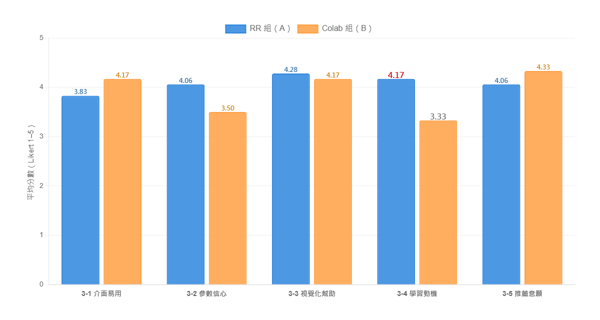
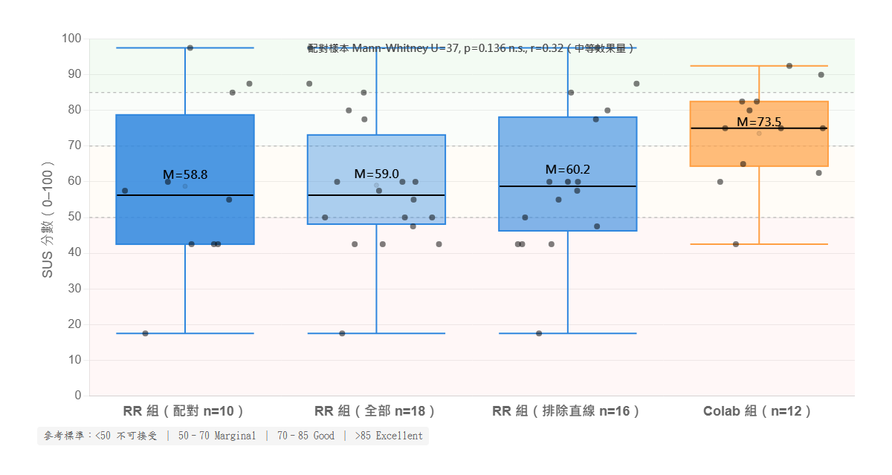

## 5.3 學習參與度與平台使用回饋

本節聚焦於學習者於課程中的主觀經驗，包含學習動機、平台使用感受、心智負荷與系統易用性等面向。相較於 5.1 與 5.2 著重「概念理解」與「任務表現」等較客觀之成效，本節所蒐集的量表與開放題回饋提供學習歷程中較難以量化之主觀經驗資料，例如學習動機是否被喚起、操作負擔是否影響專注、學習者對平台介面的整體感受等。本節之量化結果亦與 5.4 之質性觀察相互對照。

### 5.3.1 問卷設計

後測問卷於 Day 2 課堂結束前 30 分鐘以 Google Form 線上施測，與 5.1 節之概念後測為同一份問卷。本節分析之量表部分共四個區塊，依組別分流——兩組問卷在理論知識測驗（Section 1+2）與心智負荷量表為共用題目，但平台回饋與系統易用性量表依平台分流，題項中之「本系統」分別指涉 RR 或 Colab 環境。

| 區塊 | 題數 | 量表 | 量測對象 |
|------|------|------|---------|
| 平台回饋量表 | 5 題 | Likert 1–5 | 介面易用、參數信心、視覺化幫助、學習動機、推薦意願 |
| 心智負荷量表 | 6 題 | Likert 1–10 | 心智、體力、時間壓力、表現自評、努力、挫折感 |
| 系統易用性量表 | 10 題 | Likert 1–5 | 系統易用性標準量表（轉換為百分制）|
| 開放題 | 3 題 | 文字輸入 | 最有幫助的部分、最困難的部分、其他建議 |

系統易用性量表依標準計分方式（奇數題 −1、偶數題 5 −，加總後乘以 2.5）轉換為 0–100 之百分制。心智負荷量表採每題 1–10 之原始分數，本研究取六題平均作為整體心智負荷指標。

### 5.3.2 樣本範圍與分析策略

依 5.1 節採用之配對樣本邏輯（前後測皆完成且 Student ID 可成功配對者），本節主要分析以**配對樣本**為範圍：RR 組 n = 10、Colab 組 n = 12。考量小樣本下常態分配假設難以驗證，本節推論統計採用 **Mann-Whitney U 檢定**，效果量採用 r（r = |Z| / √N），其經驗準則為：r < .3 為小、.3 ≤ r < .5 為中、r ≥ .5 為大。

為提供讀者跨樣本範圍之參考，5.3.6 節以「敏感性分析」之形式並列呈現全部後測樣本（A 全部 n = 18、A 排除直線式作答 n = 16、B n = 12）與配對樣本之描述統計，作為樣本範圍選擇對結果影響之透明化呈現。需提醒讀者者：以下推論統計皆以配對樣本為準。

問卷資料整理過程中，本研究識別兩位 RR 組學生為「直線式作答」（straightlining）：

- **學生 1123505**：心智負荷量表全填 10 分、系統易用性量表全填 5 分、平台回饋量表全填 5 分。
- **學生 DH10**：心智負荷量表全填 6 分、系統易用性量表全填 5 分、平台回饋量表全填 5 分。

由於系統易用性量表設計包含正反向交替之題目（例如題 1「我願意常用本系統」與題 2「我覺得本系統過於複雜」分別為正向與反向），全部填同一分數會導致量表計算結果落在中位附近（兩位學生計算後系統易用性量表均為 50 分），無法反映真實使用感受。此兩位學生不在配對樣本（其 Student ID 於前後測未成功配對），故本節主要分析未受其影響。5.3.6 之敏感性分析中將同時列出「全部樣本」與「排除直線式作答」之描述統計供讀者比對。

### 5.3.3 平台回饋量表比較

平台回饋量表共五題，題項由設計訴求出發：Q1 介面易用、Q2 參數調整信心、Q3 視覺化幫助理解、Q4 課後學習動機、Q5 推薦意願。配對樣本下兩組之描述統計與 Mann-Whitney U 檢定結果如表 5-7 所示：

**表 5-7　平台回饋量表配對樣本比較（Likert 1–5）**

| 題項 | RR (n=10) M (SD) | Colab (n=12) M (SD) | U | p | 效果量 r | 顯著性 |
|------|-------------------|---------------------|---|---|----------|--------|
| Q1 介面易用 | 3.50 (1.65) | 4.17 (0.94) | 49.0 | .465 | .155 小 | n.s. |
| Q2 參數信心 | 3.90 (1.10) | 3.50 (1.31) | 71.0 | .471 | .155 小 | n.s. |
| Q3 視覺化幫助 | 4.30 (0.95) | 4.17 (0.72) | 70.0 | .494 | .141 小 | n.s. |
| Q4 課後學習動機 | 3.80 (1.23) | 3.33 (1.50) | 71.0 | .475 | .155 小 | n.s. |
| Q5 推薦意願 | 3.80 (1.23) | 4.33 (0.78) | 45.0 | .308 | .211 小 | n.s. |
| **整體平均** | 3.86 (1.02) | 3.90 (0.84) | 59.0 | .974 | .014 小 | n.s. |

於配對樣本下，平台回饋量表之五題與整體平均皆未達統計顯著差異（p ≥ .308），效果量皆為小。描述統計上，RR 組於 Q2 參數信心（3.90 vs 3.50）、Q3 視覺化幫助（4.30 vs 4.17）、Q4 學習動機（3.80 vs 3.33）三題分數較高；Colab 組於 Q1 介面易用（4.17 vs 3.50）、Q5 推薦意願（4.33 vs 3.80）兩題分數較高。整體平均接近（3.86 vs 3.90）。

5.3.6 之敏感性分析顯示，當 RR 組樣本範圍擴及全部後測樣本（n = 18）時，Q4 學習動機之描述差距（4.17 vs 3.33）較配對樣本（3.80 vs 3.33）為大，此差距於全部樣本下達趨近顯著（獨立樣本 t 檢定 p = .089 †），但於配對樣本下未達統計顯著。兩種樣本範圍之差異反映：僅 Day 2 出席之 RR 組學生（n = 8）對學習動機之自評較高。此一差異將於 5.3.6 與 6.5.5 進一步討論。

### 5.3.4 系統易用性比較

系統易用性量表為國際通用之系統易用性標準量表（Brooke, 1996），分數區間 0–100。依 Bangor、Kortum 與 Miller（2009）之解讀標準，50–70 為「Marginal」、70–85 為「Good」、85 以上為「Excellent」。配對樣本下兩組系統易用性結果如表 5-8 所示：

**表 5-8　系統易用性量表配對樣本比較**

| 組別 | n | M | SD | Mdn |
|------|---|------|------|------|
| RR 組（A） | 10 | 58.75 | 24.78 | 56.25 |
| Colab 組（B） | 12 | 73.54 | 14.08 | 75.00 |

Mann-Whitney U 檢定結果為 **U = 37.0, p = .136, r = .323（中度效果量），未達統計顯著**。

描述統計上 Colab 組分數高於 RR 組約 15 分，效果量為中等，惟於配對樣本（n = 10、n = 12）規模下未達 α = .05 顯著水準。Colab 組分數落於「Good」區間，RR 組分數落於「Marginal」區間。

此結果可從兩個角度解讀：

**（一）Colab 作為熟悉工具之優勢**：Colab 組多數學生已使用過 Colab 並修過相關 Python 課程，Colab 對其而言不是新工具。系統易用性量表本身難以區分「系統設計品質好」與「使用者已熟悉系統」（Sauro & Lewis, 2016），此處 Colab 組之較高分數可能同時反映兩者。

**（二）RR 作為新平台之學習曲線**：RR 組學生多為首次接觸 RR 平台，學習曲線較陡。配合 5.4 節之質性觀察（部分學生於課堂中目標感模糊、認知負荷較高），系統易用性量表偏低部分反映了「視覺化資訊密度較高造成資訊負荷」（Sweller, 1988; Mayer, 2009）之副作用——亦呼應 4.4.4 節（一）所討論之兩組設計取捨。

值得指出的是，配對樣本中 1123570（RR 組）給予系統易用性量表 17.5 之極低分，並於開放題寫下「the platform was hard to understand」。此為真實負面回饋，本研究保留此筆資料以呈現 RR 對部分學生確實存在進入門檻。系統易用性量表標準差較大（A 組 SD = 24.78）亦反映 RR 組學生對 RR 之反應呈兩極化。

### 5.3.5 心智負荷比較

心智負荷量表分數區間 1–10，分數越高代表負荷越重。配對樣本下兩組之整體平均與六項分量表結果如表 5-9 所示：

**表 5-9　心智負荷量表配對樣本比較（六項分量表 + 整體平均）**

| 構面 | RR (n=10) M (SD) | Colab (n=12) M (SD) | U | p | 效果量 r | 顯著性 |
|------|-------------------|---------------------|---|---|----------|--------|
| 心智需求 | 6.30 (1.49) | 5.58 (1.68) | 76.5 | .282 | .232 小 | n.s. |
| 體力需求 | 4.90 (2.23) | 4.50 (2.54) | 67.5 | .641 | .105 小 | n.s. |
| 時間壓力 | 4.60 (2.22) | 4.42 (2.47) | 63.5 | .841 | .049 小 | n.s. |
| 努力 | 6.40 (2.22) | 5.50 (2.65) | 73.0 | .405 | .183 小 | n.s. |
| **挫折感** | **7.10 (1.97)** | **4.92 (2.15)** | **92.0** | **.034** | **.450 中** | **\*** |
| 表現自評 | 4.50 (3.31) | 4.83 (2.76) | 54.0 | .714 | .084 小 | n.s. |
| **整體平均** | 5.63 (0.82) | 4.96 (1.15) | 83.5 | .128 | .330 中 | n.s. |

於配對樣本下，**六項分量表中僅「挫折感」達統計顯著**：RR 組 7.10 顯著高於 Colab 組 4.92（U = 92.0, p = .034 \*, r = .450 中），其餘五項分量表與整體平均皆未達顯著差異。

**「挫折感」顯著項之解讀**：

於本配對樣本下，「挫折感」為兩組唯一達統計顯著之心智負荷分項，且方向為 RR 組顯著較高，效果量為中等。配合 5.3.4 系統易用性量表 RR 組分數較低（M = 58.75 vs 73.54，r = .323 中）、5.3.7 開放題中 RR 組學生反映「資訊量過大」與「the platform was hard to understand」、以及 5.4 課堂觀察中「視覺化資訊密度造成學習目標感模糊」之記錄，此挫折感差異呈現一致之方向：**RR 平台於配對樣本下對學習者引發較高之主觀挫折感**。

此結果為設計反思之重要切入點：RR 平台早期版本同時呈現訓練曲線、Q-table 熱力圖、動作色環、三柱圖等多種視覺化元件，雖具教學設計上之資訊豐富度，但對部分學習者形成超出處理能力之資訊負荷。此一發現為 6.5 章「資訊密度控制」設計建議之實證依據之一。

**其他分項之描述觀察**：

整體心智負荷略高（5.63 vs 4.96，效果量中等但未達顯著）、心智需求略高（6.30 vs 5.58）、努力略高（6.40 vs 5.50）等方向皆呼應「資訊密度造成負荷」之整體圖像，惟於本配對樣本規模下未達統計顯著。

### 5.3.6 敏感性分析：樣本範圍對結果之影響

為提供讀者跨樣本範圍之比對，本節並列呈現「全部後測樣本（A n = 18）」、「全部排除直線式作答（A n = 16）」、「配對樣本（A n = 10）」三種樣本範圍下之描述統計，作為樣本範圍選擇對結果影響之透明化呈現。Colab 組於三種樣本範圍下皆為 n = 12（無 attrition）。

**表 5-10　樣本範圍敏感性分析（描述統計 M）**

| 指標 | A 全部 (n=18) | A 排除直線 (n=16) | **A 配對 (n=10)** | B (n=12) |
|------|---------------|-------------------|-------------------|----------|
| 平台回饋整體 | 4.09 | 3.95 | 3.86 | 3.90 |
| Q1 介面易用 | 3.83 | 3.69 | 3.50 | 4.18 |
| Q2 參數信心 | 4.06 | 3.94 | 3.90 | 3.50 |
| Q3 視覺化幫助 | 4.33 | 4.25 | 4.30 | 4.18 |
| Q4 學習動機 | 4.17 | 4.06 | 3.80 | 3.33 |
| Q5 推薦意願 | 4.06 | 4.06 | 3.80 | 4.33 |
| 系統易用性量表 | 59.0 | 60.2 | 58.75 | 73.54 |
| 心智負荷整體 | 5.72 | 5.44 | 5.63 | 4.96 |
| 心智需求 | 6.44 | 6.25 | 6.30 | 5.58 |
| 努力 | 6.83 | 6.69 | 6.40 | 5.50 |
| 挫折感 | 5.00 | 4.62 | 7.10 | 4.92 |

**樣本範圍對結果之影響**：

1. **平台回饋整體與系統易用性量表**：三種樣本範圍下 RR 組描述統計值穩定，無顯著漂移；推論統計之差異主要來自樣本規模對檢定力之影響。

2. **Q4 學習動機**：A 全部樣本下 4.17，配對樣本下 3.80。此差距源於僅 Day 2 出席之 8 名學生對學習動機之自評較高。詮釋上應以配對樣本（已完成完整課程之學習者）為主要依據。

3. **挫折感**：A 全部樣本下 5.00，配對樣本下 7.10。此漂移為三種樣本範圍中最明顯之變化。檢視配對樣本之 10 名學生發現，其中數名於 5.4 課堂觀察中曾被記錄為「資訊量過大」「目標感模糊」之學習者。此提示「完成全程的學生」對 RR 之挫折感報告高於「僅 Day 2 出席的學生」，反映「親身完整經歷資訊密度過程」對挫折感感受之影響。

此敏感性分析顯示：本研究之主要結論（5.3.3、5.3.4、5.3.5）採用配對樣本為基礎，與全部樣本下之描述統計於部分指標上呈現差異。為符合方法學一致性原則，本節推論統計皆以配對樣本進行；惟讀者可參考此敏感性分析理解樣本範圍選擇對描述結果之影響範圍。

### 5.3.7 開放題質性分析

開放題共三題：6-1 最有幫助的部分、6-2 最困難的部分、6-3 其他建議。本研究依主題歸納法整理兩組回應，並對每個主題計算其於兩組各自之**提及比例**（提及該主題之學生數 / 該組後測有效樣本數）。質性分析以後測全部有效樣本為範圍（RR n = 18、Colab n = 12），與量表推論統計（配對樣本）採用不同樣本範圍，目的為盡量呈現學生質性反映之完整圖像；惟讀者於跨節綜合詮釋時需注意此樣本範圍差異。

**（一）6-1「最有幫助的部分」之主題提及比例**

**表 5-11　6-1 主題提及比例**

| 主題 | RR 組（A，n=18）| Colab 組（B，n=12）|
|------|----------------|--------------------|
| 標準化影片被肯定 | 2 / 18（11%）| 4 / 12（33%）|
| 參數調整被肯定為「最有幫助」 | 4 / 18（22%）| 4 / 12（33%）|
| 任務/遊戲體驗被肯定 | 3 / 18（17%）| 2 / 12（17%）|
| 教師/助教協助被肯定 | 3 / 18（17%）| 1 / 12（8%）|

兩組對影片、任務、參數調整與教學環境之肯定比例方向接近。兩組皆有相當比例學生提及「參數調整」為最有幫助的部分（RR 22%、Colab 33%）。

**（二）6-2「最困難的部分」之主題提及比例**

**表 5-12　6-2 主題提及比例**

| 主題 | RR 組（A，n=18）| Colab 組（B，n=12）| Colab/RR 比例倍率 |
|------|----------------|--------------------|------|
| 參數調整困難 | 3 / 18（17%）| 5 / 12（42%）| 2.5× |
| 圖表判讀困難 | 3 / 18（17%）| 5 / 12（42%）| 2.5× |
| 概念/術語理解困難 | 3 / 18（17%）| 1 / 12（8%）| 0.5× |
| 任務不明確 / 資訊量過大 | 2 / 18（11%）| 0 / 12（0%）| RR 獨有 |
| 表示無困難 / 都好 | 6 / 18（33%）| 2 / 12（17%）| 0.5× |

質性主題提及比例之觀察：

1. **「參數調整困難」**：Colab 組提及比例 42% 較 RR 組 17% 為高。Colab 學生明確指出超參數調整為其困難（如 CHAR07 描述：「Hyperparameter Tuning. Choosing values for Learning rate (α), Discount factor (γ), Exploration rate (ε). Small changes can lead to very different behaviors」）。此質性比例差距與 5.2 任務完成時間之 T5 差距（RR 20.4 分鐘 vs Colab 33.3 分鐘，p = .0115 \*）方向一致。

2. **「圖表判讀困難」**：Colab 組提及比例 42% 較 RR 組 17% 為高。RR 之即時刷新訓練曲線與 Q-table 熱力圖，於課堂過程中提供持續觀察學習軌跡之機會；Colab 需於程式執行完畢後繪製靜態 matplotlib 圖表。

3. **「任務不明確 / 資訊量過大」**：為 RR 組獨有反映（RR 11% vs Colab 0%）。RR 組 1113551 表示「i couldn't understand what was required from me」、1123552 表示「nonstop game」——呼應 5.4 課堂觀察「視覺化資訊密度過高造成學習目標感模糊」之發現，亦呼應 5.3.5 挫折感顯著較高之量化結果。

4. **「表示無困難 / 都好」**：RR 33% 較 Colab 17% 為高。此項目可能受個別學生填答態度影響。

**（三）6-1 兩組描述風格之質性差異**

除上述比例外，兩組學生於 6-1 對「學到了什麼」之描述語言風格亦呈現差異：

- **RR 組之描述偏向「感受性」語言**：例 1123504「learned how the parameters affects the performance」、1123515「Task 4 because the content was pretty interesting and easy to understand as well」、1123570「adjusting the value」——多以「感受到」「能調」為主軸。
- **Colab 組之描述偏向「程序性」語言**：例 CHAR07「Hyperparameter Tuning. Choosing values for Learning rate (α), Discount factor (γ), Exploration rate (ε)...」、S1146155「Understanding how reward curves reflect learning progress and how different parameters (like epsilon and learning rate) affect agent behavior」——較能精準描述參數理論細節。

兩組描述風格之差異呈現一不對稱現象：Colab 組能精準命名與描述超參數，於 6-2 亦較常將其列為「最困難」；RR 組描述較模糊，於 5.2 任務時間指標上呈現較短之完成耗時。此「**程序性精準描述 vs 感受性直觀操作**」之對比為兩種教學介面風格之質性反映，惟本研究未能於量化量表上建立組間統計顯著差異。

**（四）6-3 其他建議與負面回饋**

6-3 多數學生填寫「無」「none」，提出實質建議者整理如下：

- **TL55（Colab 組）**：「teacher's code very good, straightforward explanation, but **teacher should use less AI in the explanation** especially in the videos」——針對 AI 影片教學媒介之批評。此為單一學生意見（n = 1，佔 Colab 組 8.3%），反映 AI 教學媒介於學習者接受度上仍有改善空間。對此回饋的方法學討論詳見 4.4.4 節與第六章未來工作。
- **1123570（RR 組）**：「the platform was hard to understand」（搭配系統易用性量表 = 17.5）——對 RR 平台之真實負面感受，反映平台對部分學生確實存在進入門檻。
- **CHAR07（Colab 組）** 與 **S1146155（Colab 組）** 主動請求「More example, visualization, and improve the User interface」「More side-by-side comparisons of different modes or parameter settings would help」——Colab 組學生主動請求更多視覺化與並排比較功能。
- **S1146050（Colab 組）** 與 **HCM-84（RR 組）** 對教學環境給予正面回饋。

### 5.3.8 小結

綜合平台回饋量表、系統易用性量表、心智負荷量表與開放題質性分析（配對樣本下之主要分析；質性分析以全部後測樣本為範圍），本節結論歸納如下：

1. **平台回饋量表五題於配對樣本下均未達統計顯著**：描述統計上 RR 組於 Q2 參數信心、Q3 視覺化幫助、Q4 學習動機三題略高，Q1 介面易用與 Q5 推薦意願 Colab 組略高；整體平均接近（3.86 vs 3.90，r = .014）。

2. **系統易用性量表於配對樣本下未達統計顯著**：描述上 Colab 組 73.54（Good）高於 RR 組 58.75（Marginal）約 15 分，效果量 r = .323 為中等，惟於 n = 10/12 樣本下未達 α = .05。此結果之解讀需同時考量 Colab 為熟悉工具之優勢與 RR 早期版本資訊密度較高之副作用。

3. **心智負荷量表唯一達顯著之分項為「挫折感」**：RR 7.10 vs Colab 4.92，U = 92.0, p = .034 \*, r = .450 中等。方向為 RR 較高。配合系統易用性量表、開放題「資訊量過大」與 5.4 之質性觀察，呈現一致之圖像：**RR 平台早期版本之視覺化資訊密度對學習者形成較高之主觀挫折感**。此為 6.5 章「資訊密度控制」設計建議之實證依據。

4. **質性開放題之主題提及比例顯示**：Colab 組於「參數調整困難」與「圖表判讀困難」之提及比例（42%、42%）較 RR 組（17%、17%）為高。此質性差距與 5.2 任務完成時間之 T4、T5 顯著差異（RR 用時較短）方向一致，反映 RR 即時視覺化介面於兩項主題之直觀程度。

5. **兩組描述風格差異**：RR 組偏向「感受性」語言、Colab 組偏向「程序性」語言。此差異為質性觀察所得之兩種教學介面風格反映。

6. **敏感性分析顯示**：樣本範圍對描述統計之影響於多數指標上有限，惟於 Q4 學習動機與「挫折感」兩項上呈現較明顯差距。詮釋上以配對樣本為主要依據，全部樣本之結果供參考。

7. **AI 教學影片設計獲得學生實質肯定**（兩組各有 11%、33% 提及為「最有幫助」），但有單一學生（Colab 組 TL55）反映「AI 元素過多」。

8. **Colab 組學生主動請求視覺化與並排比較功能**（CHAR07、S1146155），於設計建議層面值得參考。

本節之分析結果將於 5.4 課堂觀察記錄相互對照，並於第六章作為設計建議與未來工作之依據。
